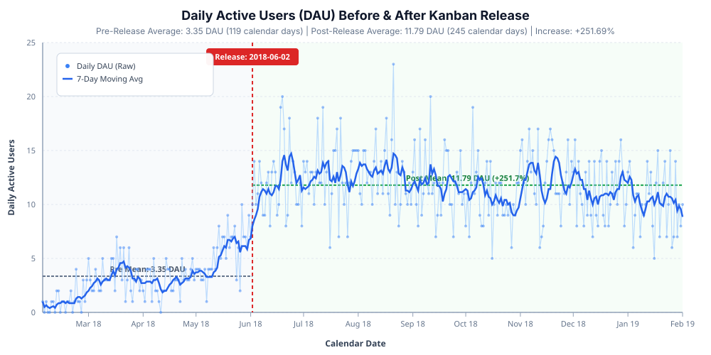
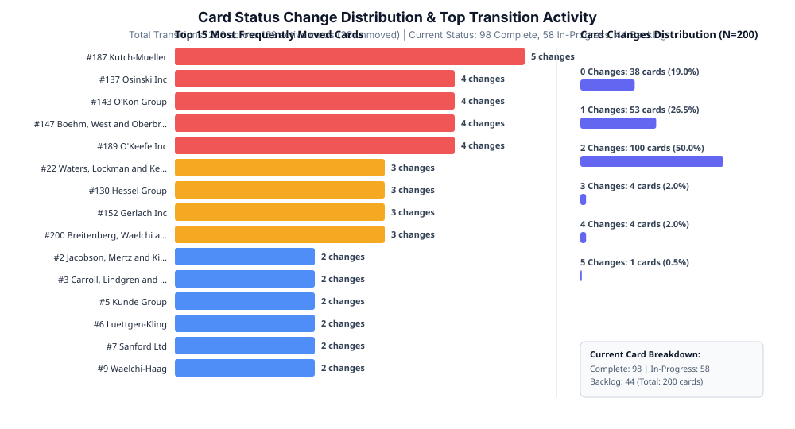

# ShipTivitas Analytics: Feature Release Impact & Product Strategy Report

**Module 3 — Analytics: Analyse the Latest Feature Releases**  
**Date of Release Analyzed:** June 2, 2018 (`2018-06-02`)  
**Data Source:** `shiptivity.db` (SQLite)  
**Analyzed Periods:** 
- **Pre-Release Period:** `2018-02-03` to `2018-06-01` (119 calendar days)
- **Post-Release Period:** `2018-06-02` to `2019-02-01` (245 calendar days)
- **Total Calendar Span:** 364 continuous calendar days

---

## Executive Summary

On **June 2, 2018**, ShipTivitas launched the interactive **Kanban Board** feature. Analysis of all user login events and card status transition histories demonstrates a substantial, sustained increase in product adoption and user engagement:

1. **Daily Active Users (DAU) Surge:**
   - **Pre-Release Average DAU:** **3.3529** users/day (across 119 calendar days, including 9 zero-login days).
   - **Post-Release Average DAU:** **11.7918** users/day (across 245 calendar days, 0 zero-login days).
   - **Net Increase:** **+8.4389 DAU** (**+251.69% increase**).
2. **User Participation Expansion:**
   - **Pre-Release Active User Pool:** 38 distinct users logged in during the 119 pre-release days.
   - **Post-Release Active User Pool:** 99 distinct users logged in during the 245 post-release days (out of 100 registered users).
   - **Daily Participation Density:** While 99 users accessed the platform post-release, the daily average of 11.79 DAU indicates that roughly 12% of registered users engage on any single average day, highlighting an opportunity to build daily engagement habits.
3. **Card Lifecycle & Current State Reconciliation:**
   - **Total Cards:** 200 cards in the system.
   - **Current Card Statuses:** **98 Complete**, **58 In-Progress**, and **44 Backlog**.
   - **Total Workflow Transitions:** 286 status movements across 162 active cards (38 cards remained unmoved in Backlog).
   - **Transition Dynamics:**
     - `backlog` $\rightarrow$ `in-progress`: **167** transitions
     - `in-progress` $\rightarrow$ `complete`: **103** transitions
     - `in-progress` $\rightarrow$ `backlog` (demotions / blockers): **11** transitions
     - `complete` $\rightarrow$ `in-progress` (re-openings): **5** transitions
   - **Reconciliation:**
     - In-Progress ($167 - 103 - 11 + 5 = \mathbf{58}$)
     - Complete ($103 - 5 = \mathbf{98}$)
     - Backlog ($200 - 167 + 11 = \mathbf{44}$)

---

## 1. Daily Active Users (DAU) Analysis

### 1.1 Methodology & Calendar Zero-Filling
To ensure statistical rigor, a continuous 364-day calendar was generated using a recursive Common Table Expression (CTE) in SQLite from `2018-02-03` to `2019-02-01`. Distinct daily user logins were left-joined to this calendar, using `COALESCE(dau, 0)` so inactive calendar days count accurately as 0.

### 1.2 Comparison Summary Table

| Metric | Pre-Release Period | Post-Release Period | Absolute Change | % Change |
| :--- | :--- | :--- | :--- | :--- |
| **Date Range** | `2018-02-03` – `2018-06-01` | `2018-06-02` – `2019-02-01` | — | — |
| **Calendar Days** | 119 days | 245 days | +126 days | — |
| **Active User Days** | 399 logins | 2,889 logins | +2,490 logins | +624.06% |
| **Zero-Login Days** | 9 days | 0 days | -9 days | -100.00% |
| **Average DAU** | **3.3529** | **11.7918** | **+8.4389** | **+251.69%** |
| **Distinct Users Active in Period** | 38 users | 99 users | +61 users | +160.53% |

### 1.3 DAU Visualization
The chart below illustrates the daily user volume alongside a 7-day moving average and pre/post mean reference levels.



---

## 2. Card Status Changes Analysis

### 2.1 Transition Overview
A total of 486 change records exist in `card_change_history`. Filtering out the 200 initial record creations (`oldStatus IS NULL`) reveals **286 genuine status changes** across the 200 cards.

### 2.2 Distribution of Status Changes per Card

| Number of Status Changes | Number of Cards | Percentage of Catalog | Cumulative Status Transitions |
| :---: | :---: | :---: | :---: |
| **0 changes** (Unmoved in Backlog) | 38 | 19.0% | 0 |
| **1 change** (`backlog` $\rightarrow$ `in-progress`) | 53 | 26.5% | 53 |
| **2 changes** (`backlog` $\rightarrow$ `in-progress` $\rightarrow$ `complete`) | 100 | 50.0% | 200 |
| **3 changes** (Multi-touch / Reverted) | 4 | 2.0% | 12 |
| **4 changes** (High churn / Re-opened) | 4 | 2.0% | 16 |
| **5 changes** (Maximum churn) | 1 | 0.5% | 5 |
| **Total** | **200 cards** | **100.0%** | **286 transitions** |

### 2.3 Top 10 Most Frequently Changed Cards

| Rank | Card ID | Card Name | Status Changes | Lifecycle Path | Current Status |
| :---: | :---: | :--- | :---: | :--- | :---: |
| **1** | #187 | Kutch-Mueller | **5** | Backlog $\rightarrow$ In-Progress $\rightarrow$ Backlog $\rightarrow$ In-Progress $\rightarrow$ Backlog $\rightarrow$ In-Progress | In-Progress |
| **2** | #137 | Osinski Inc | **4** | Backlog $\rightarrow$ In-Progress $\rightarrow$ Complete $\rightarrow$ In-Progress $\rightarrow$ Complete | Complete |
| **3** | #143 | O'Kon Group | **4** | Backlog $\rightarrow$ In-Progress $\rightarrow$ Backlog $\rightarrow$ In-Progress $\rightarrow$ Complete | Complete |
| **4** | #147 | Boehm, West and Oberbrunner | **4** | Backlog $\rightarrow$ In-Progress $\rightarrow$ Complete $\rightarrow$ In-Progress $\rightarrow$ Complete | Complete |
| **5** | #189 | O'Keefe Inc | **4** | Backlog $\rightarrow$ In-Progress $\rightarrow$ Complete $\rightarrow$ In-Progress $\rightarrow$ Complete | Complete |
| **6** | #22 | Waters, Lockman and Keebler | **3** | Backlog $\rightarrow$ In-Progress $\rightarrow$ Backlog $\rightarrow$ In-Progress | In-Progress |
| **7** | #130 | Hessel Group | **3** | Backlog $\rightarrow$ In-Progress $\rightarrow$ Complete $\rightarrow$ In-Progress | In-Progress |
| **8** | #152 | Gerlach Inc | **3** | Backlog $\rightarrow$ In-Progress $\rightarrow$ Complete $\rightarrow$ In-Progress | In-Progress |
| **9** | #200 | Breitenberg, Waelchi and Murphy | **3** | Backlog $\rightarrow$ In-Progress $\rightarrow$ Backlog $\rightarrow$ In-Progress | In-Progress |
| **10** | #2 | Jacobson, Mertz and Kiehn | **2** | Backlog $\rightarrow$ In-Progress $\rightarrow$ Complete | Complete |

### 2.4 Card Status Changes Visualization



---

## 3. Actionable Feature Proposals

Based on the quantitative insights—specifically the 58 cards currently sitting in `In-Progress`, the multi-transition churn observed on complex cards, and the opportunity to increase daily login frequency across the 99 active users—we propose the following three product feature initiatives.

```
+-----------------------------------------------------------------------------------+
|                            PRODUCT ROADMAP OVERVIEW                               |
+-----------------------------------------------------------------------------------+
| 1. WIP Limits & Stalled Card Alerts ---> Unclogs 58 In-Progress cards             |
| 2. Activity Drawer & Quick-Actions  ---> Reduces Multi-Touch Churn & Drag Fatigue |
| 3. Daily Standup Digest & Alerts    ---> Boosts Daily Login Frequency (11.8 DAU)  |
+-----------------------------------------------------------------------------------+
```

---

### Feature Proposal 1: Work-in-Progress (WIP) Limits & Stalled Card Bottleneck Alerts

#### 1. Hypothesis
Setting visual Work-in-Progress (WIP) capacity constraints on the `In Progress` swimlane and automatically flagging cards that remain idle for over 7 days will prevent task overload, encourage teams to finish existing tasks before starting new ones, and accelerate the progression of the 58 currently active cards toward completion.

#### 2. Expected Impact *(Hypothesis / Target Metric)*
- **Target Completion Rate Acceleration:** Hypothesized 15–20% increase in monthly card completions from `In Progress` $\rightarrow$ `Complete`.
- **Target DAU Growth:** Hypothesized 10–15% increase in daily active check-ins as team members collaborate to resolve flagged bottlenecks.
- **Target Cycle Time Reduction:** Aiming for a measurable decrease in median days spent per card in `In Progress`.

#### 3. What the Feature Is
- **Configurable Swimlane Capacity Limits:** Board administrators can set a maximum card capacity per swimlane (e.g., 5 cards in `In Progress`). If the limit is exceeded, the column header displays a warning badge (e.g., `6/5 Cards - Over Capacity`).
- **Stale Card Warning Badges:** Cards that have not undergone a status update or interaction for $>7$ business days receive a visual amber "Stale" indicator with elapsed time (`Idle for 9d`).
- **One-Click Blocked Reason Tagging:** When dragging a card back to `Backlog`, users can tag an optional reason (e.g., *Waiting on Client*, *Technical Blocker*) to provide visibility into workflow impediments.

```
+-----------------------------------------------------------------------------------+
| WIREFRAME: WIP Limits & Stale Card Indicator                                      |
+-----------------------------------------------------------------------------------+
|  BACKLOG (44)           IN PROGRESS (58) [OVER LIMIT!]       COMPLETE (98)        |
| +-----------------+    +--------------------------------+   +-------------------+ |
| | #12 Acme Corp   |    | #187 Kutch-Mueller [STALE: 11d]|   | #2 Jacobson Inc   | |
| | Priority: 1     |    | Priority: 1  [Blocked: Assets] |   | Priority: 1       | |
| +-----------------+    +--------------------------------+   +-------------------+ |
|                        | #137 Osinski Inc               |                         |
|                        | Priority: 2                    |                         |
|                        +--------------------------------+                         |
+-----------------------------------------------------------------------------------+
```

---

### Feature Proposal 2: In-Card Activity Audit Drawer & One-Click Quick Transitions

#### 1. Hypothesis
Cards undergoing 3 to 5 transitions (such as `#187 Kutch-Mueller` and `#137 Osinski Inc`) often lack transition context, and relying exclusively on drag-and-drop introduces friction on touch devices and small laptop trackpads. Providing an in-card audit drawer and keyboard/context-menu shortcuts ("Advance to Next Stage", "Return to Previous") will streamline card progression and eliminate drag fatigue.

#### 2. Expected Impact *(Hypothesis / Target Metric)*
- **Target Bounce Reduction:** Hypothesized 25–30% reduction in accidental or uncoordinated card demotions back to `Backlog`.
- **Target Interaction Speed:** Reduce the average time required to update a task status to under 3 seconds per action.
- **Target Device Accessibility:** Improve ease of board management on mobile and tablet touchscreens.

#### 3. What the Feature Is
- **Slide-out Activity History Drawer:** Clicking any card opens a sidebar drawer displaying the full chronological audit log (e.g., *User #42 moved card from Backlog to In-Progress on 2018-07-14 10:22*).
- **Quick-Action Buttons:** Hovering over a card reveals rapid action buttons: `[-> Move to In Progress]` or `[✓ Mark Complete]`.
- **Keyboard Shortcuts:** `J`/`K` to navigate cards and `Space`/`Enter` or `1`/`2`/`3` to switch swimlanes instantly.

```
+-----------------------------------------------------------------------------------+
| WIREFRAME: In-Card Activity Drawer & Quick Action Bar                             |
+-----------------------------------------------------------------------------------+
| CARD: #187 Kutch-Mueller                          | ACTIVITY AUDIT TRAIL          |
| Current Status: In Progress                       | ------------------------------|
|                                                   | * 2018-09-10: -> In-Progress   |
| [ <- Demote Backlog ]  [ -> Mark Complete ]       | * 2018-08-28: -> Backlog      |
|                                                   | * 2018-07-15: -> In-Progress  |
| Notes: Awaiting final design sign-off.            | * 2018-06-05: Initial Creation|
+-----------------------------------------------------------------------------------+
```

---

### Feature Proposal 3: Daily Standup Digest & Kanban Activity Push Notifications

#### 1. Hypothesis
While 99 out of 100 registered users logged in during the post-release period, the average daily active user count is 11.79 DAU (~12% daily participation density). Delivering an automated morning summary (email / Slack / webhook) of lane changes and assigned cards will create an external engagement trigger, encouraging registered users to check in on the board more consistently each day.

#### 2. Expected Impact *(Hypothesis / Target Metric)*
- **Target DAU Increase:** Aiming to lift average DAU from 11.79 to a target range of **15.0–18.0 DAU** (+27% to +52% increase).
- **Target Habit Formation:** Increase 7-day user return frequency across the 99 active user base.
- **Target Response Time:** Accelerate team response times on blocked cards from several days to within same-day business hours.

#### 3. What the Feature Is
- **Personalized Daily Digest (09:00 AM):** An automated notification summarizing:
  - Cards moved to `Complete` yesterday (celebrating team velocity).
  - Cards currently in `In Progress` assigned to the user or team.
  - Cards marked `Stale` or `Blocked`.
- **Deep Linking:** Direct one-click links in the digest open the exact card inside the ShipTivitas Kanban board.
- **Multi-Channel Delivery:** Configurable preferences for Slack, Webhooks, or Email delivery.

```
+-----------------------------------------------------------------------------------+
| WIREFRAME: Daily Standup Email / Slack Digest                                     |
+-----------------------------------------------------------------------------------+
| 📋 SHIPTIVITAS MORNING DIGEST - Today: Oct 02, 2018                              |
| Good morning Sohail, here is your team's board status:                            |
|                                                                                   |
| ✅ 3 Cards Completed Yesterday                                                    |
| ⏳ 4 Cards In Progress (1 Needs Attention: #187 Kutch-Mueller idle for 11 days)   |
| 📥 12 Cards in Backlog                                                           |
|                                                                                   |
| [ 🚀 Open Your ShipTivitas Board ]                                                |
+-----------------------------------------------------------------------------------+
```

---

## 4. Verification of SQL Deliverables (`answer.sql`)

All SQL queries in `answer.sql` were executed and verified against `shiptivity.db`:
- **Query 1 (Daily DAU Time Series):** Successfully outputs 364 continuous dates with zero-filled active user counts.
- **Query 2 (Period Comparison Summary):** Verifies 119 pre-release days (3.3529 DAU) and 245 post-release days (11.7918 DAU).
- **Query 3 (Card Status Changes):** Correctly aggregates all 200 cards with status transition counts excluding initial table insertions.
